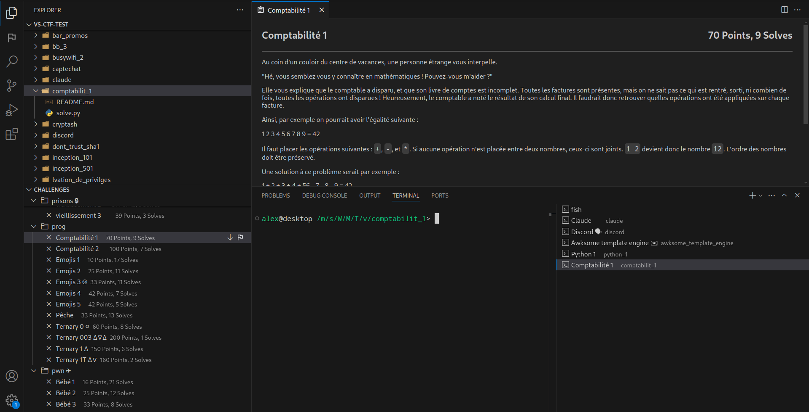

# VS CTF

All-in-one solution for CTFs in VSCode.

## Features

- Support for CTFd
- Download and local cache of challenges
- Preview tab for challenges
- Management of folders and terminals
- Quick search for most data
- Live view of scoreboard

## Installation

Download the extension on your VSCode version of choice. This can be done through [GitHub](https://github.com/alexandre-lavoie/vs-ctf/releases) or [Visual Studio Marketplace](https://marketplace.visualstudio.com/items?itemName=alexandre-lavoie.vs-ctf).

## Configuration

1. Create a new directory for your CTF (ex: `my-ctf`)
1. Click on the VS-CTF flag icon in the toolbar
1. Click the `Configure` button
1. Multiple prompts will ask for the configuration of the CTF (CTFd, custom, etc)
1. For the CTFd key, either [generate an access token](https://docs.ctfd.io/docs/api/getting-started#generating-an-admin-access-token) or copy the session token from a signed in browser.
1. Once all steps are completed, the settings will be stored in `.vscode/settings.json`. This is all the settings needed to connect to the CTF, so feel free to share it with your team
1. Sometimes, the UI may not automatically connect. Simply close and restart VSCode
1. If everything works, the explorer tab should have a `Challenges` tab at the bottom and the VS-CTF tab should have the live scoreboard

## Tips / Usage

- Descriptions are not automatically synced to prevent spamming the CTF infra. Clicking on a challenge will preview it and keep a local cached version of it
- Folder and terminal will open with the challenge name when the challenge is previewed
- Click the `Download` button to get the challenge embeds. These will be stored in the challenge folder under `download`
- Click the flag button to submit the flag. This should automatically be synced in if someone else on the team solves the challenge
